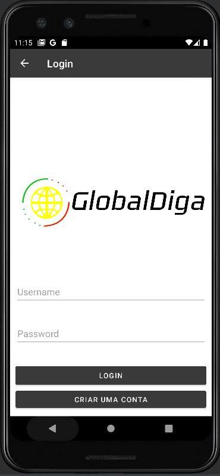
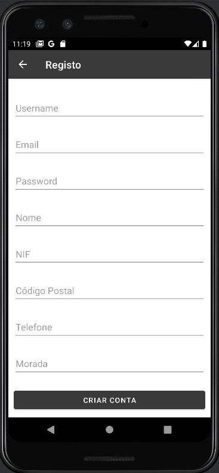
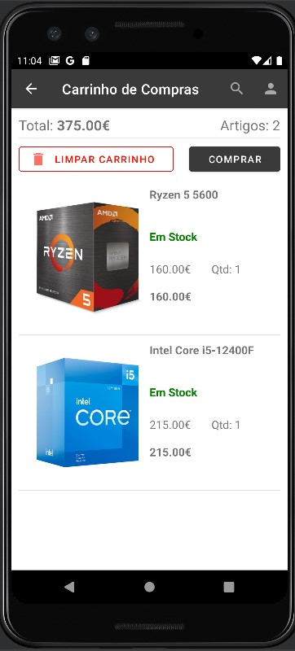
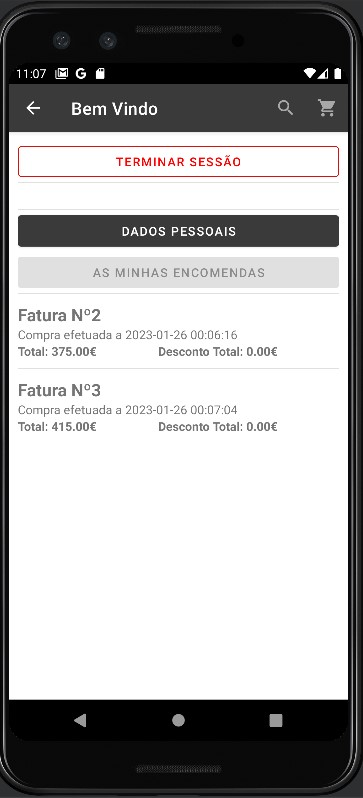

# Project GlobalDiga [Mobile APP]

 

 

#### Description:

 

> The mobile application consists of a store where it is possible to view the products, their details, make purchases through the shopping cart, view invoices, register and login where it is possible to access the reserved area where the user can change their information.
> All the requirements that were implemented, these being:

- View the products on the main page.
- View product details on the details page.
- Register as a user or login to access the reserved area.
- Add products to the cart in order to make a purchase.
- Check my past purchase invoices.
- Check my invoices if the application is offline.
- Search for products through a Search Bar.

 

> Tools used:
>
> - [Android Studio](https://developer.android.com/)
> - [SQLite](https://www.sqlite.org/)
> - [Mosquitto MQTT broker](https://mosquitto.org/)
> - [Glide](https://github.com/bumptech/glide)
> - [Zxing (QRCode Reader)](https://github.com/zxing-js/library)

 

### REST API

> API [Documentation of Endpoints](https://github.com/RFCarreira33/PSI_PLSI_22-23/tree/development/projeto_final/backend/modules/api)

 

### User Credentials

> - Username: cliente
> - Password: cliente123

### Main Page

 

 

### Product Details

 

 

### Search Bar

 

 

### Login

 

 

### Register

 

 

### Shopping Cart

 

 

### Payment Methods

 

 

### Invoices

 

 

### Invoices Details

 

 

### User Profile

 

 

 

# CO-Author

 

[@RodrigoCarreira](https://github.com/RFCarreira33)
